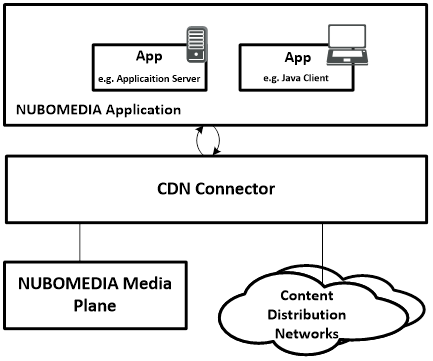
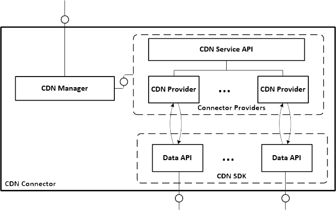

# Content Distribution Network Connector
A Content Distribution Network (CDN) which can also be called Content Delivery Networks is a distributed infrastructure of proxy servers deployed in multiple data centers with the goal of serving end user content with high availability. A large amount of content (text, graphics, scripts, media files, software, documents, etc.) on the Internet is served by CDNs. There are three main types of CDNs, namely:
* *General purpose CDN*: performs web acceleration by using multiple servers on many locations, ideally close to large connection points between Internet Service Providers (ISPs) or also within the same data center (e.g. gaming data centers). Its main role is to cache and store content that is frequently requested by a high number of users
* *On Demand Video CDN*: performs the same role as a general purpose CDN but with the focus on just video content. These CDNs also provides a streaming server for video delivery.
* *Live video CDN: provides mechanism for live video content delivery

NUBOMEDIA focuses only on *On Demand Video* CDNs. For this purpose an SDK - CDN Connector is provided to developers which offers an data APIs to access the user's data on the CDN. This can be used to upload files from the NUBOMEDIA repository to the user's CDN for publishing. 



*NUBOMEDIA CDN*


## Service Architecture
The CDN Connector constitutes three main building blocks namely the CDN Manager, a collection of Connector Providers implementing the CDN Service API and the CDN SDK publicly provided by various CDNs for use by developers to access their distribution networks.



*CDN Service Architecture*

*CDN Manager* is the core module that manages the other modules within the package. It holds a collection of listeners, providers and high abstraction sevice API of the CDN providers

| Function  |Description   |
|--------------------|--------------|
|  regiserCdnProvider(String scheme, CdnProvider provider) |Register a new CDN Provider. Input parameter is the sheme e.g. //youtube for a YouTubeProvider and a Json object with required credentials for authenticating to the registered user’s data center.   |
| unregisterCdnProvider(String scheme, CdnProvider provider)  |  Unregisters a CDN Provider from the collection of providers |
|  Video uploadVideo(String scheme, String videoURL, JsonObject jsonMessage, Credential credential, MediaHttpUploaderProgressListener listerner) | Uploads a new video file to the CDN. videoURL is the url of a stored video on the NUBOMEDIA cloud repository  |
|storeCredentials(String scheme, Credential credential)|Store User's credentials to access the user's data on CDN|


*CDN Provider Interface* specifies an inerface with specifies an interface with service functions each CDN provider needs to implement. These functions provide an API to the NUBOMEDIA application for accessing the CDN Connector services. As already introduced above, the use cases of interest are uploading, broadcasting, deleting and discovering video file stored in a registered user’s data center. 

```
public interface CdnProvider {
		
	/**
	 * Uploads a new video file to the CDN. SessionId is the
	 * @param sessionId -  identifier of a stored video on the NUBOMEDIA cloud repository
	 * @param metaData - Meta data such as title, description and tags	 
	 * @throws CdnException - Exception 
	 */
	public Video uploadVideo(String sessionId, VideoMetaData metaData) throws CdnException;
	
	/**
	 * Deletes the video with the given identifier from the CDN
	 * @param videoId - the identifier of the video file to be deleted
	 * @throws CdnException - CDN exception thrown in case of failure 
	 */
	public void deleteVideo(String videoId) throws CdnException;
	
	/**
	 * Returns a JSON object with the list of all uploaded videos on the registered user�s channel
	 * @throws CdnException - CDN exception thrown in case of failure
	 */
	public void getChannelList() throws CdnException;
	
	/**
	 * add a CDN provider listener
	 * @param listener - a new listener for CDN triggered events
	 */
	public void addProviderListener(CdnProviderListener listener);
	
	/**
	 * Remove the given CDN Provider Listener
	 * @param listener - the CDN provider listener
	 */
	public void removeProviderListener(CdnProviderListener listener);
	
	/**
	 * Store user's credentials to access the CDN network
	 * @param credential - the credential to be stored 
	 */
	public void storeCredentials(Credential credential);
}
```
## Use Case: YouTube Provider
YouTube is the most popular user content generated CDN with site traffic of 52 Million monthly visitors. It provides a Data API that allows programmatic access to authenticated users to perform many of the operations available on the website. The API provides the capability to search for videos, retrieve standard feeds, and see related content. A program can authenticate as a user to upload, modify user playlists and broadcast a live stream.

The ```YouTubeProvider``` interface has been integrated on the CDN framework. In order to use it for development, there are some prerequisites necessary

### Prerequisites - YouTube CDN
If NUBOMEDIA applications wants to make use of the YouTube Provider, some prerequisites must be fulfilled. This mainly relates to the creation of a YouTube account and a specific project associated with that account and the authorization to be able to make API requests.

1. **Create a YouTube account and a channel***: registering an account for YouTube is quite easy: visit google.com and create a new user account. With the Google account a user can make use of the YouTube services. Create a channel for your account at [Channel] (while logged in).

2. **Register a project**: Visit the developer's [Console] (while you are logged in) and create a new project. On the left menu, go to ```APIs ``` -> ```APIs``` and enable the YouTube Data API

3. **OAuth configuration**: YouTube uses OAuth 2.0 to authorize API requests. Therefore you need to configure credentials that will be used by your web application (aka NUBOMEDIA webrtc client) to retrieve an access token. The access token and other parameter will be sent with the client requests to the connector so that the YouTube connector is able to make YouTube API requests.

In the left menu (same page like in step 2) go to ```APIs & auth```; -> ```Credentials```. Click on ```Create new Client ID```->```Web application```. Then new credentials will be generated.

[Channel]: https://www.youtube.com/channel
[Console]: https://console.developers.google.com
