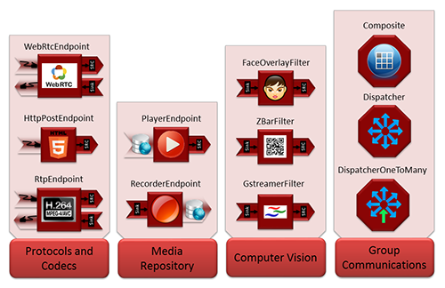
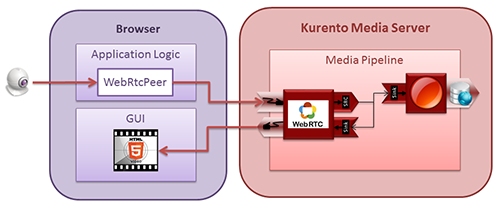

# Overview

The NUBOMEDIA Media API has the objective of exposing media capabilities through a pipelining mechanism. To achieve this aim, this API is based on two concepts that act as building blocks for application developers:

- **Media Elements**. A Media Element is a functional unit performing a specific action on a media stream. Media Elements are a way of every capability is represented as a self-contained “black box” to the application developer, who does not need to understand the low-level details of the element for using it. Media Elements are capable of receiving media from other elements (through media sources) and of sending media to other elements (through media sinks). There are a rich toolbox of different Media Elements ready to be used by developers out of the box. NUBOMEDIA inherits the rich toolbox provided by Kurento (see figure below). For further information please visit the [Kurento documentation](http://doc-kurento.readthedocs.org/en/stable/introducing_kurento.html). Depending on their function, Media Elements can be split into different groups:
	- Input endpoints: Media Elements capable of receiving media and injecting it into a pipeline.
	- Filters: Media Elements in charge of transforming or analyzing media. Hence there are filters for performing operations such as mixing, muxing, analyzing, augmenting, etc.
	- Hubs: Media Objects in charge of managing multiple media flows in a pipeline.
	- Output wndpoints: Media Elements capable of taking a media stream out of the pipeline. Again, there are several types of output endpoints specialized in files, network, screen, etc.



*Media Elements Toolbox*

- **Media Pipeline**: A Media Pipeline is a chain of Media Elements, where the output stream generated by one element (source) is fed into one or more other elements input streams (sinks). Hence, the pipeline represents a “machine” capable of performing a sequence of operations over a stream. For example, if you want to create an application recording WebRTC streams into the file system, you’ll need two media elements: *WebRtcEndpoint* and *RecorderEndpoint*. When a client connects to the application, you will need to instantiate these media elements making the stream received by the *WebRtcEndpoint* (which is capable of receiving WebRTC streams) to be feed to the *RecorderEndpoint* (which is capable of recording media streams into the file system). Finally you will need to *connect* them so that the stream received by the former is fed into the later:



*Media Pipeline Example*

# NUBOMEDIA Media Client

In order to deploy your application on the NUBOMEDIA Cloud Platform, there a specific NUBOMEDIA library which should be include as dependency to your projects. This library is called **NUBOMEDIA Media Client (NMC)**, and provides the base functionality to compliment the Kurento Client for auto discovery of the Kurento Media Server inside the NUBOMEDIA PaaS. NMC extend the Kurento Client library  with functionalities on how to obtain network resources (for example the IP address of the Kurento Media Server). 

In order to obtain the NMC, it can be done by means of [Maven](https://maven.apache.org/) in a Java project. The NMC is distributed can be found on [Maven central repository](http://search.maven.org/#search%7Cga%7C1%7Cde.fhg). Simply include it on your project's *pom.xml* file as describe below. Notice that the original Kurento Client library is also required:

```xml
<dependencies>
   <!-- Kurento client dependency -->
   <dependency>
      <groupId>org.kurento</groupId>
	  <artifactId>kurento-client</artifactId>
   </dependency>

   <!-- Nubomedia client dependency -->
   <dependency>
      <groupId>de.fhg.fokus.nubomedia</groupId>
      <artifactId>nubomedia-media-client</artifactId>
      <version>6.5.0</version>
   </dependency>
</dependencies>
```

!!! info

    We are in active development. Please take a look to the [Maven Central Repository](http://search.maven.org/) to find out the latest version of the artifacts.

With these two dependencies included in our Java project, we are able to create instances of [Kurento Client](http://doc-kurento.readthedocs.org/en/stable/introducing_kurento.html#kurento-api-clients-and-protocol), which is the object in charge of creating Media Pipelines and Media Elements. Inside NUBOMEDIA, the instances of KMSs are elastically managed by the platform, scaling in and out depending on the number of Kurento Client instances. All in all, for each media session of a NUBOMEDIA application, an instance of Kurento Client should be created, as follows:

```java
    // One KurentoClient instance per session
    KurentoClient kurentoClient = KurentoClient.create();
```

The way of creating `KurentoClient` objects is very important in NUBOMEDIA applications. This object is aimed to control a KMS instance. Inside NUBOMEDIA, there could be one or several KMS instances. The maximum amount of KMSs instances is configured in the value `replicasNumber` in the PaaS Manager (see [PaaS Manager GUI](../paas/paas-gui.md) or [PaaS Manager API](../paas/paas-api.md)).

The total amount of points for a Media Servers depends on the flavor of machine in which KMS is running. That way, a KMS running in a `MEDIUM` machine have 200 point available for Media Pipelines (i.e. 2 VCPU x 100 points/VCPU), whilst a `LARGE` machine has a total amount of 400 points (4 VPCU). Each time a Media Pipeline using a `KurentoClient` object, the available amount of points is reduced (depending the number and type of Media Elements contained in the pipeline). When the available points reaches 0, and if the application is able to leverage (i.e., there are replicas available), the NUBOMEDIA PaaS start another KMS. This is the way in which the NUBOMEDIA PaaS provides scale out for applications.

There is a way to force the number of points available for a `KurentoClient` object. An `Properties` object can be passed as argument to the constructor with the value `loadPoints`. For instance, the following snippet requests the creation of a `KurentoClient` with a `loadPoints` value of `100`. This means that the NUBOMEDIA PaaS should warranty that the KMS controlled by this object has at least `100` points available. 

```java
    import org.kurento.client.KurentoClient;
    import org.kurento.client.Properties;

    // ...

    Properties properties = new Properties();
    properties.add("loadPoints", 100);
    KurentoClient kurentoClient = KurentoClient.create(properties);
```

For a running example of the NUBOMEDIA applications, please take a look to the **tutorials** within this documentation (the [nubomedia-magic-mirror](../tutorial/nubomedia-magic-mirror.md) is a good start to understand how to use the NUBOMEDIA Media API).
