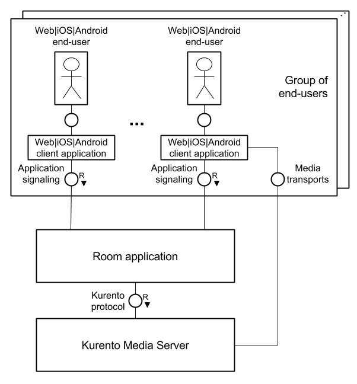

# Overview

The NUBOMEDIA Room API enables application developers functionalities to create group communication applications adapted to real social interactions. It has been designed for the development of real time conferencing applications basin on room models. In these, each group of participants share a virtual space known as *room* where different resources (e.g. media streams, chat messages, etc.) are shared among the members but isolated to members of other group. The room API makes possible to manage rooms and participants as well as the communication resources they require in a Kurento Media Server instance. The architecture of an application based on the NUBOMEDIA Room API is illustrated in the figure below:



*Room Architecture*

The NUBOMEDIA Room API can be used safely as long as the following requirements are satisfied:

- The API assumes that all clients participating in a room are based on WebRTC transports. The API does not provide support for other types of RTC transports off-the-shelf.

- The API is based on the NUBOMEDIA Signaling Protocol (i.e. a custom protocol based on JSON-RPC over WebSocket). Hence, the API cannot interoperate with other types of signaling mechanisms such as SIP or XMPP.

# Examples and Use Cases

The typical example of an application using the Room API is Single Page Application (SPA) based on the Room Server and the Room JavaScript Client. This application enables users to simultaneously establish multiple connections to other users connected to the same session or room. These steps to implement this application are the following:

- Include the SDK module to the dependencies list.
- Create one ```RoomManager``` instance by providing an implementation for one of the following interfaces: ```RoomEventHandler``` or ```KurentoClientProvider```.
- Develop the client-side of the application for devices that support WebRTC (or use client-js library and take a look at the demo’s client implementation).
- Design a room signaling protocol that will be used between the clients and the server (or use the WebSockets API from room-server).
- Implement a handler for clients’ requests on the server-side that use the ```RoomManager``` to process these requests (hint: JSON-RPC handler from ```room-server```).
- Choose a response and notification mechanism for the communication with the clients (JSON-RPC notification service from room-server).

This documentation contains a complete use case of the NUBOMEDIA Room API deployed in the NUBOMEDIA PaaS Manager. Please visit the [tutorial](../tutorial/nubomedia-room.md) section for detailed information.  

# API Availability

The NUBOMEDIA room API is available in the following programming languages

Server API:

-  Java 6.0 or later

Client API:

- JavaScript
- Android 4.0 or later
- iOS 7.0 or later

# Resources

Full official documentation:

- [Room server API](http://doc-kurento-room.readthedocs.org/)
- [Room protocol API](http://doc-kurento-room.readthedocs.org/en/latest/websocket_api_room_server.html)
- [WWW room client API](http://doc-kurento-room.readthedocs.org/en/latest/client_javascript_api.html)
- [Android room client API](http://kurento-room-client-android.readthedocs.org/)
- [iOS room client API](http://kurento-ios.readthedocs.org/en/latest/dev_guide.html#kurento-room)

API Source code:

- [Room server API](https://github.com/Kurento/kurento-room/tree/master/kurento-room-sdk)
- [Room JavaScript client API](https://github.com/Kurento/kurento-room/tree/master/kurento-room-client-js)
- [Room Android client API](https://github.com/nubomedia-vtt/kurento-room-client-android)
- [Room iOS client API](https://github.com/nubomediaTI/Kurento-iOS)
