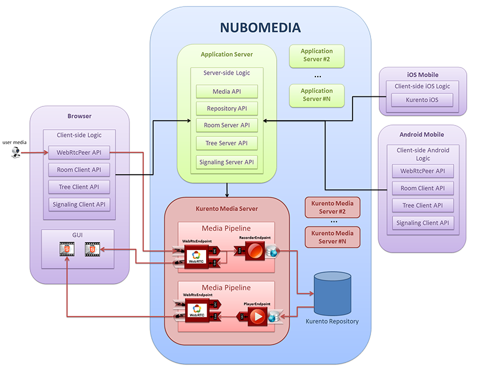
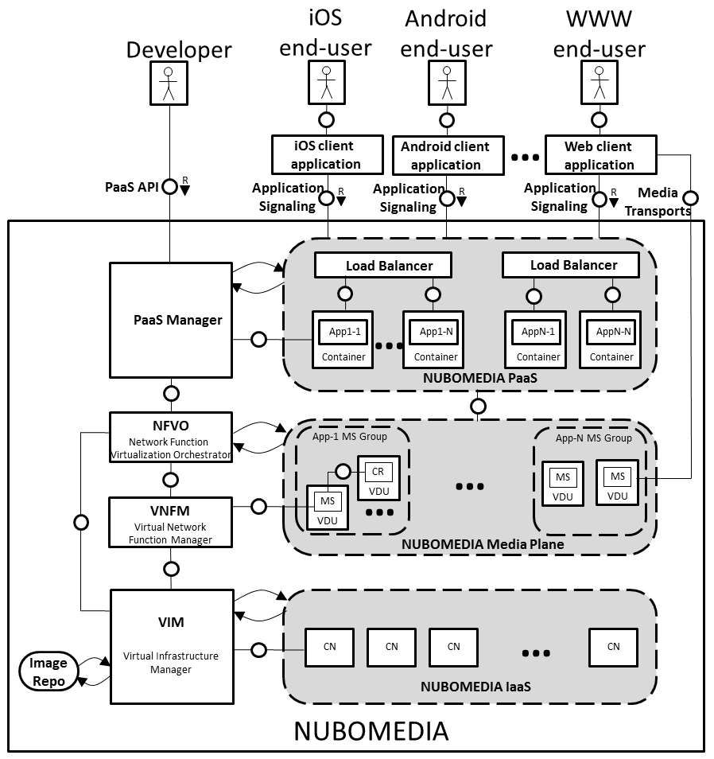
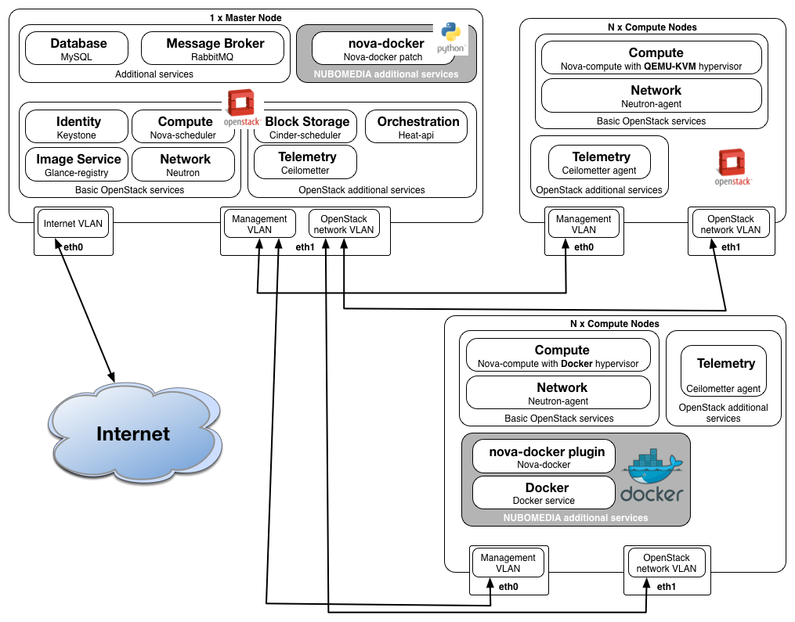

# NUBOMEDIA Overview

NUBOMEDIA is an open source elastic cloud **PaaS** (Platform as a Service)
specifically designed for real-time interactive multimedia services, which
exposes its capabilities through a simple **APIs**. From the developer’s
perspective, NUBOMEDIA capabilities are accessed through a set of APIs inspired
by the popular Web three tier model (see figure below). In this model, web
developers distinguish three layers:

- The *Client*, typically which consists on a web browser executing the
  client-side application logic. This logic is typically developed using
  programming languages such HTML and JavaScript, and with the help of
  specialized third party APIs (e.g. Angular, Bootstrap, etc.)

- The *Application Server (AS)*, which hosts the server-side application
  logic. This layer typically contains the business logic of the application.

- The *Service Layer* comprise a number of services that are required for the
  application to work. In NUBOMEDIA, this layer is composed by a set of
  **Media Servers** (namely, [Kurento Media
  Server](http://doc-kurento.readthedocs.org/)) and a **Media Repository**
  (i.e. the [Kurento
  Repository](http://doc-kurento-repository.readthedocs.org/)).

The NUBOMEDIA Media Server has the objective of providing the NUBOMEDIA platform
with a media function capability that can be used for creating a cloud media
plane with the appropriate media capabilities and suitable for working with
elastic scalability. This means that the number of media server is controled by
the NUBOMEDIA PaaS, scaling in and out depending on the load of the system.

The following picture illustrates the main components of NUBOMEDIA. Next
sections of this page introduces these NUBOMEDIA APIs (Media, Repository,
WebRtcPeer, Signaling, Room, Tree) and provides a detailed description of the
NUBOMEDIA archictecture.

*NUBOMEDIA Overview*

# NUBOMEDIA Development APIs

The NUBOMEDIA Development API stack is architected following the scheme depicted
in the following figure. This stack offers a complete set of APIs that can be
classified in three groups: **Media Capabilities APIs**, **Signaling APIs** and
**Abstract Communication APIs**.

*NUBOMEDIA API stack*

## Media Capabilities APIs

From the developer’s perspective, NUBOMEDIA capabilities are accessed through a
set of APIs. Hence, for creating NUBOMEDIA enabled applications developers just
need to understand these NUBOMEDIA Development APIs so that they may use them
for creating their rich RTC media applications. These APIs expose to the
application logic the low-level media capabilities of NUBOMEDIA. These
capabilities are basically the ones offered by the **NUBOMEDIA Media Server**
and the **NUBOMEDIA Media Repository**. As a result, this group includes two
APIs:

- The [NUBOMEDIA Media API](./api/media.md), which enables developers
  consuming the NUBOMEDIA Media Server capabilities among which we can find
  media transport, media archiving, media processing, media transcoding, etc.
  This API is based on two main concepts: Media Elements and Media Pipelines.

- The [NUBOMEDIA Repository API](./api/repository.md), which makes possible
  to access an elastic scalable media repository for archiving media
  information and meta-information. It is based on the notion of Repository
  Item: an object with a unique identity which may contain media data and
  meta-data.

In addition, in this group we also include a NUBOMEDIA API abstracting the
client side media capabilities for developers. In current state-of-the-art,
these capabilities basically correspond to WebRTC and comprise both the ability
of capturing and rendering media plus the ability of communicating RTC media.
In NUBOMEDIA, we have abstracted all these capabilities behind the [WebRtcPeer
API](./api/webrtcpeer.md).

## Signaling APIs

The Media Capabilities APIs introduced above are signaling agnostic, meaning
that they neither require nor assume any kind of specific characteristic for
signaling. Hence, NUBOMEDIA capabilities can be accessed through any kind of
signaling protocol including SIP, XMPP or REST. However, for simplifying common
development tasks, in NUBOMEDIA  architecture we propose a simple signaling
protocol based on **JSON-RPCs** that is suitable for most applications not
requiring specific interoperability features. This protocol has been wrapped
through an abstract API which enables full-duplex signaling exchanges between
Application Server and Clients. To this aim, the API is split into two
complementary parts:

- The [NUBOMEDIA Client Signaling API](./api/signaling.md). This is a
  client-side API enabling the creation of JSON-RPC sessions and the sending
  and receiving of messages through them.

- The [NUBOMEDIA Server Signaling API](./api/signaling.md). This is a
server-side API enabling the creation of JSON-RPC sessions and the
implementation of server-side business logic for messages following a
request/response communication scheme

## Abstract Communication APIs

Developers typically use RTC media capabilities for creating applications
devoted to person-to-person communications. In this case, the application
business logic needs to manage the communication topologies among participants
in an RTC multimedia session. In the general case, this logic needs to be
programmed by the application developers. However, there are a number of
communication topologies that are quite  popular and appear systematically in
applications. Due to this, in our architecture, we propose specific
communication API abstracting the low level details of the media logic on these
topologies so that developers may use them in an agile and efficient manner. In
particular, we have identified two of these common topologies: the Room
Topology and the Tree Topology. For them two specific APIs have been
implemented:

- The [Room API](./api/room.md). This API has two complementary sides, the
  Room Server and the Room Client APIs. Through them, this API makes possible
  for developers to create applications basing on Room Topologies. Room
  topologies are based on the intuitive idea of a physical room where people
  may communicate. If you enter into the room you may talk to others and others
  may talk to you. Hence, the main characteristic of a Room Topology is that
  the multimedia session enables a full-duplex communication exchange of media
  among all participants. Hence, the session is called informally room and all
  room members may publish their media streams to the room or subscribe to the
  streams of the rest of room members.

- The [Tree API](./api/tree.md). Like the Room API, it also has Server and
  Client sides. However, this API is based on a Tree Topology. In our context,
  a tree can be sees as a oneway (i.e. simplex) mechanism providing one-to-many
  RTC media. The interesting aspect of this topology is that the number of
  leafs of the tree may be large, which makes convenient for providing
  real-time media broadcasting capabilities to large audiences.

# NUBOMEDIA Architecture

The NUBOMEDIA architecture complies with the ETSI (European Telecommunications
Standards Institute) NFV MANO (Network Function Virtualization Management and
Orchestration)
[specification](http://www.etsi.org/deliver/etsi_gs/NFVMAN/001_099/001/01.01.01_60/gs_nfv-man001v010101p.pdf).
The following picture shows this architecture created using [Fundamental
Modeling Concepts (FMC)](http://www.fmc-modeling.org/).

*NUBOMEDIA Architecture*

## PaaS Manager

The PaaS Manager is the part of the system enabling developers to deploy and
manage their server-side applications. The PaaS Manager is the component in
charge of the full lifecycle of a NUBOMEDIA application, defined as a
combination of the server-side application logic, hosted on the PaaS, and its
required media functions, hosted on the NUBOMEDIA Media Plane, and NUBOMEDIA
IaaS.

Take a look the [PaaS Manager page](./paas/paas-introduction.md) for further
details on this component, and also about the [PaaS API](./paas/paas-api.md)
and the [PaaS GUI](./paas/paas-api.md).

## NUBOMEDIA PaaS

The NUBOMEDIA PaaS hosts the server-side application logic on top of on demand
deployed Application Servers . For this, it needs to provide a set of services
to the PaaS Manager, which mediates between developers and the PaaS. These
services must make possible to deploy, scale and manage the application
lifecycle. The NUBOMEDIA PaaS architecture comprise a number of building
blocks, which are the following:

- Core services: authentication, data store, scheduler, management/replication

- APIs: The core services of the NUBOMEDIA PaaS are provided as
  micro-services. Micro-services is a software architecture approach in which
  complex applications are split into small independent processes which
  communicate among each other using language agnostic APIs.

- Containers, pods and nodes: Containers are the basic unit of NUBOMEDIA PaaS
  applications. A container corresponds with the Linux notion of containers as
  a lightweight mechanism for isolating running processes. The NUBOMEDIA PaaS
  uses [Docker containers](http://www.docker.com). Nodes, in turn, are worker
  machines, physical or virtual, where pods are run. Following Kubernetes
  terminology, a pod is an application logical host in a containerized
  environment. In other words, pods are collocated groups of containers that
  make up the application.

  - Registry. The registry is a service for storing and retrieving Docker
  images. It contains a collection of Docker image repositories. In the case of
  NUBOMEDIA, all applications are deployed using Docker containers and the PaaS
  provides an internal registry for managing custom Docker images.

## Network Function Virtualization Orchestrator (NFVO)

Each time a developer requests the instantiation of an application, the PaaS
Manager firstly requests the deployment of a set of Virtualized Network
Functions (VNF), defined as Network Service, then instantiates the application
on the PaaS providing all the details of the media functions that are dedicated
to it. [NFV](https://portal.etsi.org/nfv/nfv_white_paper.pdf) (Network
Functions Virtualization) is designed to consolidate and deliver the networking
components needed to support a fully virtualized infrastructure, including
virtual servers, storage and even other networks.

The Network Function Virtualization Orchestrator (NFVO) is the component
managing the lifecycle of a Network Service (NS) composed by multiple Media
Server (MS) and a Cloud Repository (CR).

## Virtual Network Function Manager (VNFM)

The Virtual Network Function Manager (VNFM) provides lifecycle management for a
Virtualized Network Function (VNF). On the one hand, the MS-VNFM is specific
and its functionalities are adapted to managing Media Server functions. On the
other hand, the Cloud Repository one (CR-VNFM) is based on a generic
architecture.

The MS-VNFM provides an API to applications deployed in the NUBOMEDIA PaaS for
retrieving dynamically the available Media Servers. This API is consumed by the
NUBOMEDIA Media API implementation to determine in which specific Media Server
instance a newly created Media Pipeline is placed. Allocating new Media
Pipelines is transparent to the developer, who just needs to create the Media
Pipelines without worrying about where they are located. For this, the VNFM has
been extended with the autoscaling component, providing semantics to that
placement interface and guaranteeing the availability of Media Servers through
an horizontal autoscaling mechanism based on two operations: scaling-out (i.e.
to add resources when necessary) and scaling-in (i.e. to remove resources when
they are no longer required). Both, the scaling-in and -out, are fired by
simple autoscaling policies based on QoS metric thresholds, so that, for
example, further resources are added when the average CPU load of Media Server
instances is over an upper limit and resources are collected when it’s under a
lower bound.

## Virtual Infrastructure Manager (VIM)

The Virtual Infrastructure Manager (VIM) provides an interface for controlling
the NUBOMEDIA IaaS. As in the ETSI NFV specification, the VIM follows the
OpenStack approach and, through its APIs, offers the ability to start new
computing resources by using already pre-configured images containing the
appropriate artifacts for every of the required functions. The computing nodes
are instantiated on the NUBOMEDIA IaaS on top of one or more Compute Nodes.
Computing nodes are distributed across physical machines depending on the
required flavors and resources.

## NUBOMEDIA Media Plane

The NUBOMEDIA Media Plane provides the media capabilities to NUBOMEDIA
applications. These capabilities include media transport, media archiving and
media processing. The scalability of the NUBOMEDIA Media Plane is controlled by
the NFVO component, which adapts it to the load offered by applications.

### Media Server

A Media Server (MS) comprises a number of Media Pipelines (MPs). MPs are graphs
of interconnected Media Elements (MEs). Each ME implements a specific media
capability: media transport, media archiving or media processing.

A ME can be seen as a black box taking media from a sink, applying a specific
media capability (e.g. processing, transporting, etc.), and issuing media
through a source. MEs have different flavors (i.e. types) in correspondence
with their different specialties (e.g. RtpEndpoint, RecorderEndpoint,
FaceDetectorFilter, etc.).

### Media Repository

The Cloud Repository provides scalable archiving capabilities to NUBOMEDIA. The
Cloud Repository is able to store Repository Items, which comprise multimedia
data and metadata. Repository Items can be recovered later querying them
through ID or through any kind of information present into its metadata.
Repository Item metadata consists on arbitrary JSON, which is quite convenient
for developers.

## NUBOMEDIA IaaS

NUBOMEDIA PaaS hides the underlying complexity of an IaaS platform that enables
developers to build multimedia applications without infrastructure knowledge.
The elastic nature of the IaaS enables developers to build multimedia apps that
scale easily with an increase of usage. IaaS capabilities are exposed through
APIs that are used by the Virtual Infrastructure Manager to provide hardware
resources to the upper levels of the NUBOMEDIA IaaS.

The NUBOMEDIA IaaS is based on OpenStack and has two types of compute nodes.
Some of the compute nodes are based on QEMU-KVM hypervisor and the other types
of compute nodes are running Docker containers using the nova-docker plugin.

The main services of OpenStach which have been deployed for NUBOMEDIA are:
Nova, Neutron, Glance, Cinder, Keystone and Horizon. All the services running
on the IaaS level are available through certain end-points which are following
OCCI-OGF standards.

For enabling of rapid deployment of new Media Server instances by the MS-VNFM,
we created a nova-docker patch that pulls all docker container images available
on Glance on all compute nodes running the Docker as a hypervisor. This way the
instantiation of new Docker containers inside the IaaS is done in less than one
second. The IaaS architecture is presented in the following diagram.

*IaaS Architecture*

