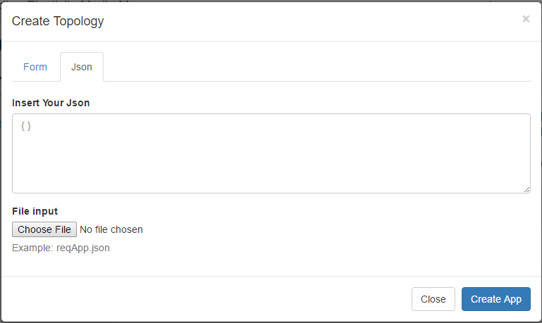
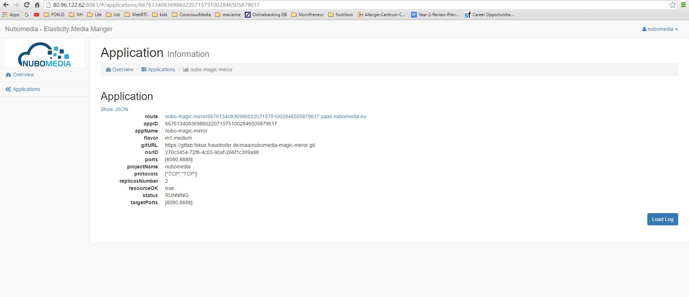

# PaaS Manager

This documentation describes how to use the PaaS Manager via the esposed REST APIs. 

## Getting Started
Information on how to access the PaaS Manager interface and credentials needed can be found here: [URL]( https://www.nubomedia.eu/redmine/projects/nubomedia/wiki/Accessing_NUBOMEDIA_PaaS). If you want access to the platform [contact us](mailto:nubomedia-dev@googlegroups.com). 

Once logged in, on the start view, you should see a blue box with the number of already deployed applications. Click on ```View Details```. Alternatively on the left hand side menu click on ```Applications```. On the next mask above, there is a button ```Create App```. The next section explains in details the procedure on creating your application.

## Create an Application

In order to create in order words deploy your application on NUBOMEDIA PaaS, it is important that you followed the previous steps provided in the [Guidelines on Building Application](https://github.com/nubomedia/developer-guidelines/blob/develop/docs/paas/paas-introduction.md) in order to understand how to create an application for NUBOMEDIA. If you made all the steps required, you should get at the end a URL of a GIT repository where your Dockerfile is contained. See [sample example] (https://github.com/fhg-fokus-nubomedia/nubomedia-magic-mirror). 

Once you have all files assembled, the Create App View on the PaaS Manager GUI provides you two options to create your application - a FORM view and JSON view. Here the JSON view is what you wish to use. Explanation on using the FORM view is found [here](https://github.com/nubomedia/developer-guidelines/edit/develop/docs/paas/paas-gui.md).
For the JSON view, you should see a mask similar to the image below.


*PaaS Manager - Create App - JSON View*

For instantiating this application on the NUBOMEDIA PaaS you should create a JSON object like the following: 

```
{
	"gitURL": "https://github.com/fhg-fokus-nubomedia/nubomedia-magic-mirror.git",
	"appName": "nubo-magic-mirror",
	"projectName": "nubomedia",
	"cloudRepository": true,
	"flavor": "MEDIUM",
	"ports": [{
		"port": 8443,
		"targetPort": 8443,
		"protocol": "TCP"
	}, {
		"port": 443,
		"targetPort": 443,
		"protocol": "TCP"
	}],
	"replicasNumber": 2,
	"turnServerActivate": true,
	"stunServerActivate": true,
	"stunServerIp": "192.168.1.1",
	"stunServerPort": "8080",
	"turnServerUrl": "localhost:8080",
	"turnServerUsername": "nubomedia-prod",
	"turnServerPassword": "test",
	"scaleInOut": 1,
	"scale_out_threshold": 50,
	"qualityOfService": "GOLD"
}
```

where: 
* ```gitURL``` - the Git repository URL tha contains your project (source or jar), Dockerfile and other files that are necessary to run your application. If the repository is public the link has to be the https version, if is private has to be the ssh version
*  ```appName``` - is the name of your application as you would want it to appear on the PaaS. This name is used for creating the DNS entry for your application.
*  ```projectname``` - OpenShift project name under which your application should be deployed. Default value is *nubomedia* don't change for now
*  ```cloud repository``` - Boolean value of ```true``` or ```false``` indicating if your application will be needing the cloud repository (the cloud repository is a running instance of the [Kurento repository server](http://doc-kurento-repository.readthedocs.org/en/latest/server.html) application)
*  ```flavor``` - This defines the size of the KMS instances. With MEDIUM flavor, you get 2 VCPU and with LARGE flavor you have 4VCPU. The capacity is defined as 100 points for VCPU.
*  ```ports``` - Indicate the transport protocol and ports exposed for your application. The port is the port exposed by the container on which  your application will be running, and the target port is the external port on which your application is reacheable for the outside. So there is a mapping coming on within the PaaS for the port and target port. In principle, you can leave the port and target port the same, unless your application has special requirments.
*  ```replicasNumber```- is a numeric value indicating the number of containers to be created for your application by the PaaS. This value is used for load balancing.
*  ```turnServerActivate``` - Boolean value of ```true``` or ```false``` indicating if you want a TURN server to be set on the path of your application
*  ```stunServerActivate``` - Boolean value of ```true``` or ```false``` indicating if you want a STUN server to be set on the path of your application
*  ```stunServerIp"``` - The IP address of the STUN server you wish to use
*  ```stunServerPort``` - The port of the SUN server you wish to use
*  ```turnServerUrl``` - The IP address and port of the TURN server you wish to use
*  ```turnServerUsername``` -  The username to be used as credentials to access the TURN server 
*  ```turnServerPassword``` -  The password to be used as credentail to access the TURN server
*  ```scaleInOut``` - Scale in or out indicates the MAX number of media servers (KMS) instances that will be instantiates at runtime, by the auto scaling system.
*  ```scale_out_threshold``` - This is the threshold (in terms of averaged number of points) which will be used for the policy of the autoscaling system. CHECK which flavor you are going to use before defining this threshold. **NOTE! Do not put a value lower than the total capacity of your flavor!**
*  ```qualityOfService``` -  If enabled it provides dedicated bandwidth levels between media server instances (optional). Possible values are:
	* BRONZE
	* SILVER
	* GOLD

When all values have been entered, click on the ```Create App```button below. Your request will be forwarded to the PaaS Manager and you will be directed the a view similar to the image below, which shows you the status to the creation process. ```Status``` gives you the status of the process. You might want to reload this page incase you see no update to the status field. The ```Load log``` button shows you the real time process status from NUBOMEDIA PaaS.


*PaaS Manager - Create App - Creatiion status View*

Once the Status = RUNNING, your application has been successfully deployed, and it is running on the PaaS. Click on  ```Applications``` -> ```app ID``` of your application. You should see the ```route`` under which your application is `reachable from the browser. 


