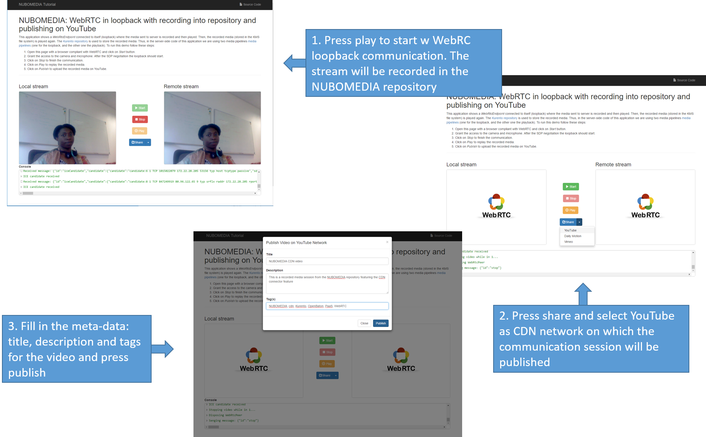
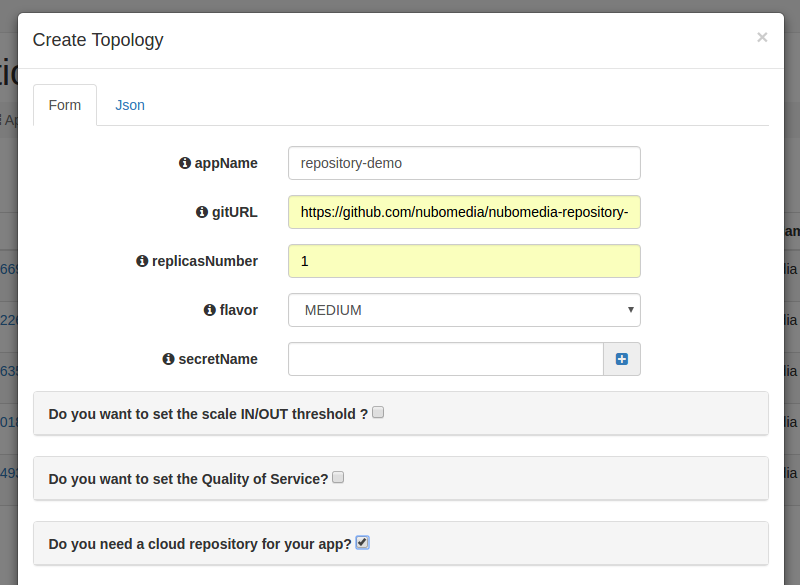

# NUBOMEDIA CDN Tutorial

This application is an example of the usage of the [CDN Connector](../advanced/cdn_connector.md). The application is based on the [Nubomedia repository tutorial](nubomedia-repository.md), adapted to utilize the CDN SDK to deploy the stored video on the NUBOMEDIA repository on the user's YouTube channel.



*NUBOMEDIA CDN Screenshots*

## Looking into the source code

This application is open source (LGPL license) and it is available on [GitHub](https://github.com/nubomedia/nubomedia-cdn-tutorial).

 [1](nubomedia-repository.md) explains in details of the NUBOMEDIA Repository. This section concerntrates only on the service logic in utilizing the CDN connector SDK.
 
 Dependencies we will need to include on our [pom.xml](https://github.com/nubomedia/nubomedia-cdn-tutorial/blob/master/pom.xml) include:
 
```xml
<dependency>
    <groupId>de.fhg.fokus.nubomedia</groupId>
    <artifactId>nubomedia-media-client</artifactId>
    <version>1.0.2</version>
</dependency>
<dependency>
    <groupId>de.fhg.fokus.nubomedia</groupId>
    <artifactId>nubomedia-repository-client</artifactId>
    <version>1.0</version>
</dependency>
<dependency>
  	<groupId>de.fhg.fokus.nubomedia</groupId>
	  <artifactId>nubomedia-cdn-client</artifactId>
	  <version>0.0.7</version>
</dependency>
```

!!! info

    We are in active development. Please take a look to the [Maven Central Repository](http://search.maven.org/) to find out the latest version of the artifacts.


- We need a single instance of the `CdnManager`. In this example, this is done by means of a Spring Bean (see [RepositoryApp](https://github.com/nubomedia/nubomedia-cdn-tutorial/blob/master/src/main/java/eu/nubomedia/tutorial/repository/CdnApp.java) class):    

```java
  @Bean
  public CdnManager cdnClient() {
    return new CdnManager();
  }
```
- As can be seen in the [handler](https://github.com/nubomedia/nubomedia-cdn-tutorial/blob/master/src/main/java/eu/nubomedia/tutorial/repository/CdnRepositoryHandler.java), each time a *publish* message arrives to the application server, the created user session is fetched from which the repository Item URL is obtained new [UserSession](https://github.com/nubomedia/nubomedia-repository-tutorial/blob/master/src/main/java/eu/nubomedia/tutorial/repository/UserSession.java) class is created and a new media session is created is created:

```java
  private void publish(WebSocketSession session, JsonObject jsonMessage) {
   //Get the active user session
   UserSession user = users.get(session.getId());

		if(user != null){			
			Video publishedVideo = null;
			try {
				//Get repository item URL
				String repoURL = user.getRepositoryItemURL();
				
				//publish the video
				publishedVideo = cdnManager.uploadVideo(Schemes.YOUTUBE, repoURL, jsonMessage, credential, new MediaHttpUploaderProgressListener(){
					@Override
					public void progressChanged(MediaHttpUploader uploader) throws IOException {
						JsonObject resp = new JsonObject();
						switch (uploader.getUploadState()) {
						case INITIATION_STARTED:
							log.debug("Initiation Started");

							resp.addProperty("id", "publishResponse");
							resp.addProperty("msg", "Initiation Started");
							session.sendMessage(new TextMessage(resp.toString()));

							break;
						case INITIATION_COMPLETE:
							log.debug("Initiation Completed");

							resp.addProperty("id", "publishResponse");
							resp.addProperty("msg", "Initiation Completed");
							session.sendMessage(new TextMessage(resp.toString()));
							break;
						case MEDIA_IN_PROGRESS:
							log.debug("Upload in progress, " + uploader.getProgress() + "%");

							resp.addProperty("id", "publishResponse");
							resp.addProperty("msg", "Upload in progress "+ uploader.getProgress() + "%");
							session.sendMessage(new TextMessage(resp.toString()));
							break;
						case MEDIA_COMPLETE:
							log.debug("Upload Completed!");

							resp.addProperty("id", "publishFinished");
							resp.addProperty("msg", "Upload Completed. Your video can now be found on the selected CDN platform");
							session.sendMessage(new TextMessage(resp.toString()));
							break;
						case NOT_STARTED:
							log.debug("Upload Not Started!");                       
							break;
						}				
					}        	
				}); 							
			} catch (Exception e) {
				// TODO: handle exception
			}
			finally {
				if(publishedVideo!=null)
				{
					JsonObject resp = new JsonObject();
					resp.addProperty("id", "publishFinished");
					resp.addProperty("msg", "Video ID:"+ publishedVideo.getId());				
					sendMessage(session, new TextMessage(resp.toString()));
				}				
			}
		}else{
			log.debug("No active user founf for this session");
		}
	}
```

## Deployment

The deployment of this application can be done by means of the PaaS Manager directly from the source code hosted on GitHub. To do that, first of all we need to define a [Dockerfile](https://github.com/nubomedia/nubomedia-cdn-tutorial/blob/master/Dockerfile) inside our project. 

```
FROM nubomedia/apps-baseimage:src

MAINTAINER Nubomedia

ADD keystore.jks /
ADD . /home/nubomedia

RUN sudo chown -R nubomedia /home/nubomedia
RUN cd /home/nubomedia && mvn compile

ENTRYPOINT cd /home/nubomedia && mvn exec:java
```

Examining the  content of this file, we can see how the content of the project is included into the platform:

* `ADD . /home/nubomedia`: This line includes the whole content of the project.
* `ADD keystore.jks /`: This line includes the the Java keystore to the root. This is required to serve the application by HTTPS, which is mandatory in the latest version of WebRTC in browsers. 

After that, several Maven command are configured:

* `RUN cd /home/nubomedia && mvn compile`: Compile the project.
* `ENTRYPOINT cd /home/nubomedia && mvn exec:java`: Run the deployed application.


At this point, we are able to deploy our application in NUBOMEDIA. To that aim, we can use the [PaaS Manager GUI](http://paas-manager.nubomedia.eu:8081/#/) (please visit the [PaaS Manager GUI section](../paas/paas-api.md) for further details).

!!! info

    The access to the PaaS Manager should be done with authentication credentials (login/password). So far, this access is restricted. If your are interested in getting access, please send an email to the [nubomedia-dev](https://groups.google.com/forum/#!forum/nubomedia-dev) list asking for permission.

Once logged in the PaaS Manager, first we have to click on the *Create App* button inside the *Applications* section. It is very important to define the [GitHub URL](https://github.com/nubomedia/nubomedia-repository-tutorial) in which the project is hosted. In this example, we are not using the scaling mechanisms and a single number of replicas. Finally, it is very important to mark the checkbox "**Do you need a cloud repository for your app?**", since the repository it is a requirement for the application: 



*PaaS Manager Settings for Repository Tutorial*

We can check out the building log by clicking the *Build log* button. If everything goes fine, our application should move to the *RUNNING* state. In that case, our application will be up and running inside NUBOMEDIA. In this case, we are able to trace our application logs by clicking on the *App log* button.
