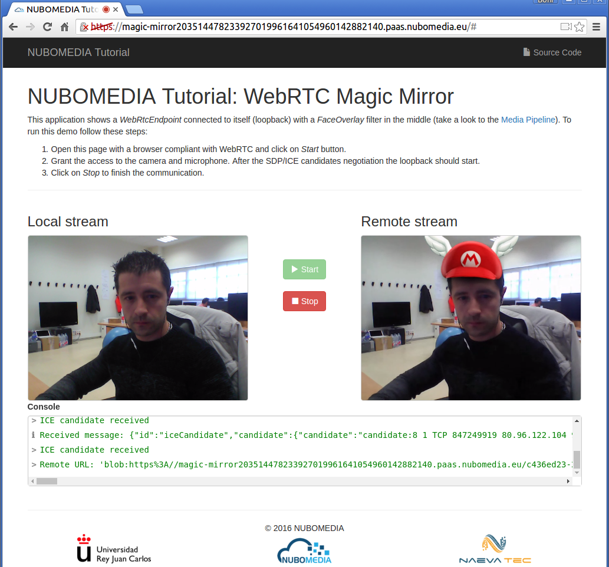
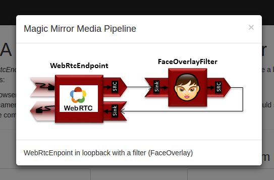
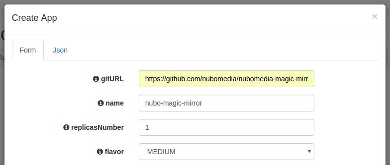

# NUBOMEDIA Magic-Mirror Tutorial

This application is an example of usage of the [Media API](../api/media.md). This application is based on the [Kurento magic-mirror tutorial](http://doc-kurento.readthedocs.org/en/stable/tutorials/java/tutorial-magicmirror.html), adapted to be deployed on the [NUBOMEDIA PaaS](../paas/paas-introduction.md).

## Understanding this example

This application uses computer vision and augmented reality techniques to add a funny hat on top of the detected faces in a WebRTC stream. The following picture shows a screenshot of the demo running in a web browser:



*NUBOMEDIA Magic Mirror Screenshot*

The **Media Pipeline** implemented in the server-side of this demo is composed by the following **Media Elements**:

- *WebRtcEndpoint*: Provides full-duplex (bidirectional) WebRTC capabilities.

- *FaceOverlay filter*: Computer vision filter that detects faces in the video stream and puts an image on top of them. In this demo the filter is configured to put a [Super Mario hat](http://files.kurento.org/img/mario-wings.png). 



*Magic Mirror Media Pipeline*

## Looking into the source code

This application is open source (LGPL license) and it is available on [GitHub](https://github.com/nubomedia/nubomedia-magic-mirror). From a functional point of view, the logic is very similar to the Java version of [Kurento magic-mirror tutorial](http://doc-kurento.readthedocs.org/en/stable/tutorials/java/tutorial-magicmirror.html). For further details (server-side, client-side), please visit that documentation.

In order to migrate the existing Kurento application to the NUBOMEDIA cloud, several aspects have to be taken into consideration:

- To add *nubomedia-media-client* as dependency. As depicted in the [Media API](../api/media.md) section, this library should be included in any Java application which is going to be deployed in the NUBOMEDIA PaaS. Since this tutorial is created in Maven, the following dependency should de included in the [pom.xml](https://github.com/nubomedia/nubomedia-magic-mirror/blob/master/pom.xml):

```xml
<dependency>
    <groupId>de.fhg.fokus.nubomedia</groupId>
    <artifactId>nubomedia-media-client</artifactId>
    <version>1.0.1</version>
</dependency>
```

<br>

!!! info

    We are in active development. Please take a look to the [Maven Central Repository](http://search.maven.org/) to find out the latest version of the artifacts.

- The way in which the *Kurento Client* is instantiated should be changed. As depicted on [Kurento documentation](http://doc-kurento.readthedocs.org/en/stable/introducing_kurento.html#kurento-api-clients-and-protocol), the Kurento Client is the piece of software aimed to control the **Kurento Media Server (KMS)**. Inside NUBOMEDIA, the instances of KMSs are elastically managed by the platform, scaling in and out depending on the load of the system. In Kurento tutorials, the way of creating Kurento Clients is done by means of Spring Beans, and so, there is a single instance of Kurento Client by application. This makes sense when a single instance of KMS is being used (which is the typical way of working just with Kurento). Inside NUBOMEDIA this is not always true, and therefore we need to create a new instance of *KurentoClient* for every media session. This is implemented in the Java class [UserSession](https://github.com/nubomedia/nubomedia-magic-mirror/blob/master/src/main/java/eu/nubomedia/tutorial/magicmirror/UserSession.java). As can be seen in the [handler](https://github.com/nubomedia/nubomedia-magic-mirror/blob/master/src/main/java/eu/nubomedia/tutorial/magicmirror/MagicMirrorHandler.java), each time a *start* message arrives to the application server, a new [UserSession](https://github.com/nubomedia/nubomedia-magic-mirror/blob/master/src/main/java/eu/nubomedia/tutorial/magicmirror/UserSession.java) class is created. In the constructor of that class, an instance of *KurentoClient* is created:

```java
  public UserSession(String sessionId) {
    this.sessionId = sessionId;

    // One KurentoClient instance per session
    kurentoClient = KurentoClient.create();
    log.info("Created kurentoClient (session {})", sessionId);

    mediaPipeline = getKurentoClient().createMediaPipeline();
    log.info("Created Media Pipeline {} (session {})", getMediaPipeline().getId(), sessionId);

    webRtcEndpoint = new WebRtcEndpoint.Builder(getMediaPipeline()).build();
  }
```

> It is very important to release this instance of *KurentoClient* when the media session is finished. This is implemented in the method `release` of the [UserSession](https://github.com/nubomedia/nubomedia-magic-mirror/blob/master/src/main/java/eu/nubomedia/tutorial/magicmirror/UserSession.java) class:

```java
  public void release() {
    log.info("Releasing media pipeline {} (session {})", getMediaPipeline().getId(), sessionId);
    getMediaPipeline().release();
    log.info("Destroying kurentoClient (session {})", sessionId);
    getKurentoClient().destroy();
  }
```

> This release process can be triggered by two events.

>> 1- On the reception of the `stop` message in the [handler](https://github.com/nubomedia/nubomedia-magic-mirror/blob/master/src/main/java/eu/nubomedia/tutorial/magicmirror/MagicMirrorHandler.java). This message is sent from the [client-side](https://github.com/nubomedia/nubomedia-magic-mirror/blob/master/src/main/resources/static/js/index.js) of the application when the user explicitly clicks on the *Stop* button on the GUI:

```javascript
function stop(stopMessage) {
	console.log("Stopping video call ...");
	setState(I_CAN_START);
	if (webRtcPeer) {
		webRtcPeer.dispose();
		webRtcPeer = null;

		if (stopMessage == undefined || stopMessage) {
		    var message = {
			    id : 'stop'
		    }
		    sendMessage(message);
		}
	}
	hideSpinner(videoInput, videoOutput);
}
```

>> 2- When the WebSocket used for signaling between the client and server-side is closed. This event is captured in the [handler](https://github.com/nubomedia/nubomedia-magic-mirror/blob/master/src/main/java/eu/nubomedia/tutorial/magicmirror/MagicMirrorHandler.java) as follows:

```javascript
  @Override
  public void afterConnectionClosed(WebSocketSession session, CloseStatus status) throws Exception {
    log.info("Closed websocket connection of session {}", session.getId());
    release(session);
  }
```

>> In addition, in the [client-side](https://github.com/nubomedia/nubomedia-magic-mirror/blob/master/src/main/resources/static/js/index.js), the event `onbeforeunload` is captured to close explicitly the WebSocket. This happens for example when user closes directly the browser (instead of clicking the *Stop* button). In the end this a web application, and that situation is very usual. Thus, the application should be implemented properly to release the resources.

```javascript
var ws = new WebSocket('wss://' + location.host + '/magicmirror');

window.onbeforeunload = function() {
	ws.close();
}
```

## Deployment

The deployment of this application can be done by means of the PaaS Manager directly from the source code hosted on GitHub. To do that, first of all we need to define a [Dockerfile](https://github.com/nubomedia/nubomedia-magic-mirror/blob/master/Dockerfile) inside our project. 

```
FROM nubomedia/apps-baseimage:src

MAINTAINER Nubomedia

ADD keystore.jks /
ADD . /home/nubomedia

RUN sudo chown -R nubomedia /home/nubomedia
RUN cd /home/nubomedia && mvn compile

ENTRYPOINT cd /home/nubomedia && mvn exec:java
```

Examining the  content of this file, we can how the content of the project is included into the platform:

* `ADD . /home/nubomedia`: This line includes the whole content of the project.
* `ADD keystore.jks /`: This line includes the the Java keystore to the root. This is required to serve the application by HTTPS, which is mandatory in the latest version of WebRTC in browsers. 

After that, several Maven command are configured:

* `RUN cd /home/nubomedia && mvn compile`: Compile the project.
* `ENTRYPOINT cd /home/nubomedia && mvn exec:java`: Run the deployed application.


At this point, we are able to deploy our application in NUBOMEDIA. To that aim, we can use the [PaaS Manager GUI](http://paas-manager.nubomedia.eu:8081/#/) (please visit the [PaaS Manager GUI section](../paas/paas-api.md) for further details).

!!! info

    The access to the PaaS Manager should be done with authentication credentials (login/password). So far, this access is restricted. If your are interested in getting access, please send an email to the [nubomedia-dev](https://groups.google.com/forum/#!forum/nubomedia-dev) list asking for permission.

Once logged in the PaaS Manager, first we have to click on the *Create App* button inside the *Applications* section. It is very important to define the [GitHub URL](https://github.com/nubomedia/nubomedia-magic-mirror) in which the project is hosted. In this example, we are not using the scaling mechanisms and a single number of replicas:



*PaaS Manager Settings for Magic Mirror Tutorial*

We can check out the building log by clicking the *Build log* button. If everything goes fine, our application should move to the *RUNNING* state. In that case, our application will be up and running inside NUBOMEDIA. In this case, we are able to trace our application logs by clicking on the *App log* button.
